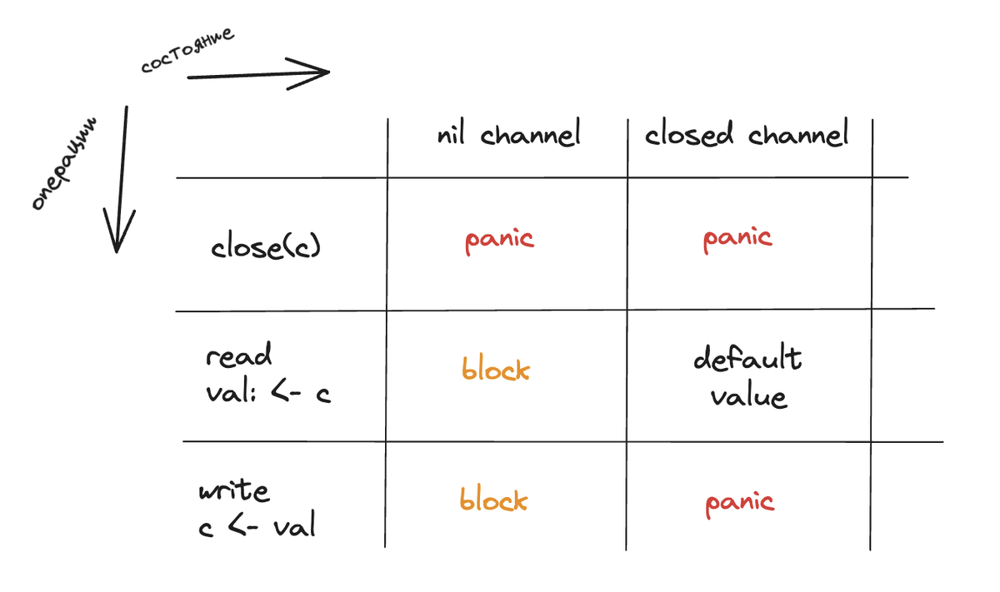

# Channels Battle

- ### 1_STATES

Реализация состояний таблицы

- ### 2_Some_Examples

Различные примеры, наброски, черновик

- ### Fan_IN_OUT

Fan-in — это стратегия мультиплексирования, при которой входы нескольких каналов объединяются в один выходной канал. 

Fan-out — это обратная операция, при которой один канал разделяется на несколько каналов.

- ### Fibonacci

Числа фибоначи

- ### GeneratorNums
 
Генератор случайных чисел с использованием канала

- ### Merge_2_Channels

Функция func Merge(f func(int) int, in1 <-chan int, in2 <-chan int, out chan <- int, n int)

- ### Pipeline

Конвейерная обработка данных (pipeline), в которой последовательность чисел из массива input проходит через три этапа обработки: генерация, добавление 1 и умножение на 2, и результат выводится в консоль

- ### RC 

Обход Race condition (MUTEX)

- ### Read_Buf_chanel

Чтение из закрытого буферизированного канала 

- ### ReadTwoChan

Общение горутин через каналы

- ### Semaphore

Создаем пул из трех рабочих горутин, которые выполняют некоторый рабочий цикл

- ### Start

Канал и горутина (без WG)

- ### Worker_pool

Пул воркеров

- ### WorkerGroup

Работа с горутин и каналов с использованием WaitGroup

